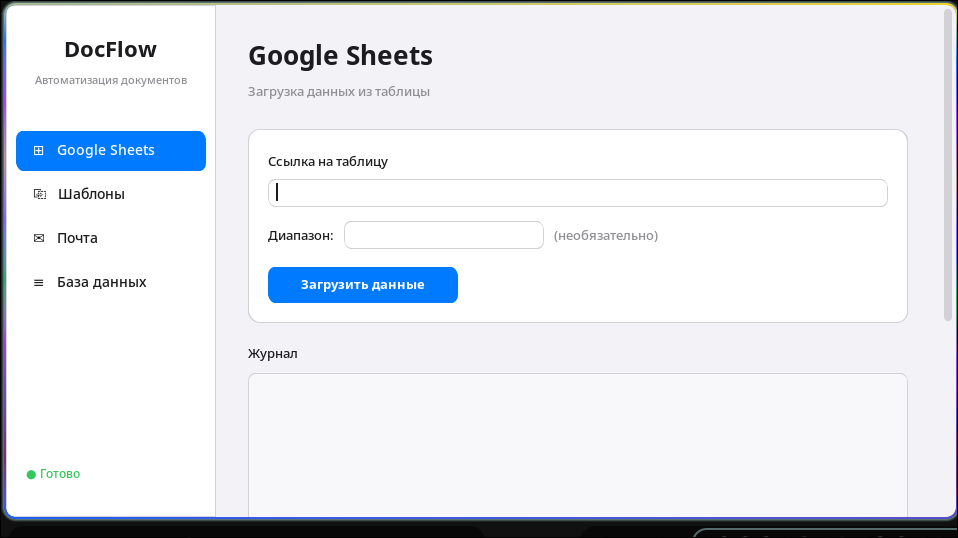
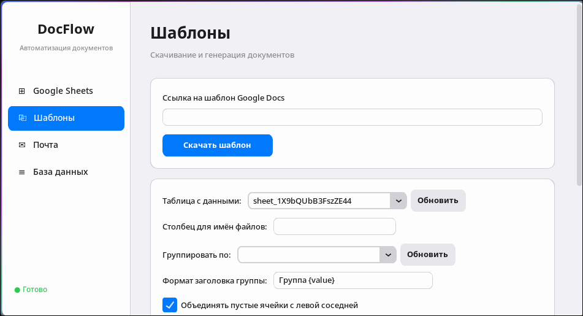
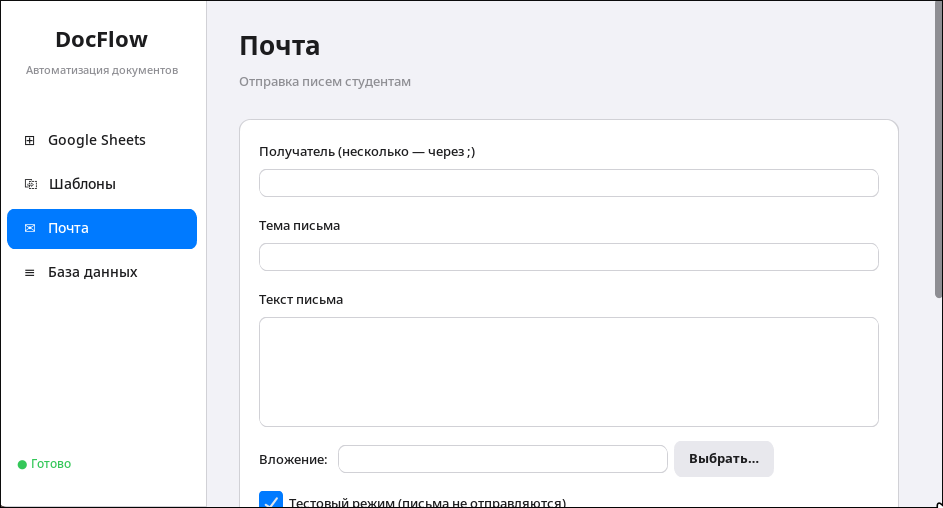
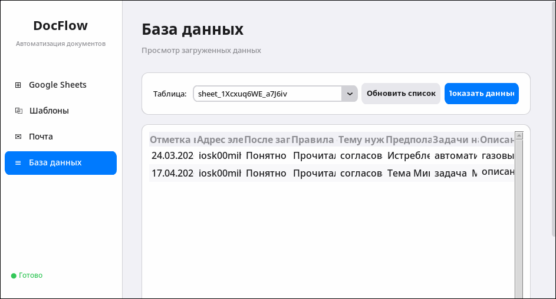

# Lappo ITAS

> Автоматизируй рутину: Google Таблицы → персональные документы → Gmail — в три клика.


---

## 📖 Описание

**Lappo ITAS** — десктопное приложение на Python для автоматизации подготовки и рассылки документов. Оно загружает данные из Google Таблиц, применяет их к шаблонам Word из Google Документов и отправляет готовые файлы по почте через Gmail. Весь процесс управляется через простой графический интерфейс с четырьмя вкладками — без написания кода.

Приложение особенно удобно там, где нужно регулярно формировать одинаковые по структуре документы для множества людей: справки, договоры, уведомления, дипломы.

## 💡 Как появилась идея


Мой отец работает электриком на производстве и каждую неделю вручную переносил данные из журнала измерений в Word-шаблоны протоколов. При 15–20 протоколах в неделю это выливалось в несколько часов очень монотонной работы. Задача оказалась идеальной для того, чтобы её закрыть автоматизацией: данные структурированы, шаблон стандартный, процесс повторяется почти один в один. Я взялся за инструмент, который превратил бы многочасовую рутину в трёхминутную операцию — без написания пользователем ни строчки кода.


---

## 🛠 Технологический стек

| Технология | Версия | Для чего используется |
|---|---|---|
| Python | 3.10+ | Основной язык |
| tkinter | встроен | GUI-интерфейс (4 вкладки) |
| SQLite | встроен | Локальная БД: кэш таблиц, шаблонов, лог писем |
| google-api-python-client | ≥ 2.100.0 | Google Sheets и Drive API |
| google-auth-oauthlib | ≥ 1.1.0 | OAuth2-авторизация через браузер |
| python-docx | ≥ 1.1.0 | Генерация и редактирование .docx |
| python-dotenv | ≥ 1.0.0 | Загрузка конфигурации из `.env` |
| smtplib | встроен | Отправка почты через Gmail SMTP |

### Нестандартные решения

**`python-docx` + собственный движок шаблонов** — вместо сторонних шаблонизаторов реализована своя замена плейсхолдеров `${ИмяПоля}` прямо внутри `.docx`, с сохранением оригинального форматирования (жирный, курсив, размер шрифта). Это редко встречается в open-source инструментах такого класса.

**SQLite как промежуточный слой** — данные из Google Sheets не обрабатываются напрямую, а сначала сохраняются в SQLite. Это даёт кэширование, возможность работы офлайн и просмотр загруженных данных прямо в интерфейсе.

---

## ✨ Возможности

- **Загрузка Google Таблиц** — ввод URL, опциональный диапазон (`Sheet1!A:Z`), сохранение в SQLite-кэш
- **Импорт шаблонов из Google Docs** — экспорт в `.docx` или прямое скачивание загруженного файла
- **Гибкие плейсхолдеры** в шаблонах:
  - `${ИмяПоля}` — значение конкретного столбца текущей строки
  - `${table}` — вся таблица данных целиком
  - `${table:Кол1,Кол2}` — таблица с выбранными столбцами
  - `${row}` — текущая строка как таблица
  - `${row:Кол1,Кол2}` — строка с выбранными столбцами
- **Пакетная генерация** — один `.docx` на каждую строку данных
- **Поддержка кириллики** — заголовки с русскими названиями работают как в шаблонах, так и в имени файла
- **Рассылка по Gmail** — отправка с вложениями, поддержка plain text и HTML
- **Dry-run режим** — проверка рассылки без реальной отправки (включён по умолчанию)
- **Лог писем** — полный аудит отправок прямо в базе данных
- **Просмотр данных** в интерфейсе — вкладка «База данных» показывает загруженные таблицы с оригинальными заголовками

---

## 🚀 Установка и запуск

### Предварительные требования

1. Python 3.10+
2. Google Cloud проект с включёнными API:
   - Google Sheets API
   - Google Drive API
3. OAuth2-ключи (тип: Desktop application), скачанные как `credentials.json`
4. Gmail-аккаунт с двухфакторной аутентификацией и **паролем приложения**

### Установка

```bash
# 1. Клонировать репозиторий
git clone https://github.com/Gudi00/lappo_ITAS.git
cd lappo_ITAS

# 2. Создать и активировать виртуальное окружение
python -m venv venv
source venv/bin/activate        # Linux / macOS
# venv\Scripts\activate         # Windows

# 3. Установить зависимости
pip install -r requirements.txt
```

### Настройка

```bash
# 4. Создать папку для учётных данных и положить туда credentials.json
mkdir credentials
# Скопируй скачанный из Google Cloud Console файл:
cp ~/Downloads/credentials.json credentials/credentials.json

# 5. Создать файл конфигурации
cp .env.example .env
```

Отредактируй `.env`:

```env
GMAIL_ADDRESS=your_email@gmail.com
GMAIL_APP_PASSWORD=xxxx xxxx xxxx xxxx
GOOGLE_CREDENTIALS_PATH=credentials/credentials.json
OUTPUT_DIR=output
TEMPLATES_CACHE_DIR=templates_cache
DATABASE_PATH=app_database.db
```

### Запуск

```bash
python main.py
```

При первом запуске откроется браузер для Google OAuth2-авторизации. После этого токен кэшируется в `credentials/token.json`.

---

## 📸 Скриншоты и демо


*Вкладка «Google Таблицы» — загрузка и кэш*


*Вкладка «Шаблоны» — список плейсхолдеров*


*Вкладка «Email» — поля и Dry-run чекбокс*


*Вкладка «База данных» — кириллические заголовки*

---

## 💼 Как я использую этот проект


Параллельно использую сам для генерации персонализированных писем (поздравления, приглашения, рассылки по студенческим группам) и для подготовки одинаковых документов под нескольких получателей. Dry-run режим включён по умолчанию: за всё время использования не было ни одной случайной отправки не тому адресату.


---

## 👥 Аудитория и пользователи

Проект ориентирован на:

- **Сотрудников учебных заведений** — секретарей, деканатов, отделов кадров, кому нужно массово выпускать типовые документы
- **HR-специалистов** — формирование договоров, приказов, уведомлений по шаблону
- **Администраторов** — рассылка персонализированных писем с вложениями без MailChimp и платных платформ
- **Python-разработчиков** — как отправная точка для собственного инструмента автоматизации документов


---

## ⚙️ Как реализован проект

### Архитектура

Приложение состоит из восьми модулей с чётким разделением ответственности:

```
main.py              ← точка входа, проверка зависимостей
config.py            ← загрузка .env, пути к папкам
gui.py               ← tkinter GUI, 4 вкладки, threading
  ├── google_sheets.py  ← Sheets API, OAuth2, fetch + sync
  ├── google_docs.py    ← Drive API, скачивание шаблона
  ├── template_engine.py ← замена плейсхолдеров, генерация .docx
  ├── email_sender.py   ← Gmail SMTP, dry-run, batch
  └── database.py      ← SQLite: реестр таблиц, шаблонов, лог писем
```

### Ключевые технические решения

**Промежуточный SQLite-кэш.** Данные из Google Sheets сохраняются в локальную базу перед генерацией. Имена столбцов с кириллицей транслитерируются для SQLite, но оригинальные заголовки сохраняются в JSON — интерфейс показывает именно их.

**Собственный движок шаблонов.** `template_engine.py` обходит параграфы, таблицы, колонтитулы документа и заменяет `${...}` прямо в XML-структуре `.docx`, не трогая форматирование. Поддерживает вставку целых таблиц данных на место плейсхолдера.

**Потокобезопасный GUI.** Все долгие операции (API-запросы, генерация файлов) выполняются в daemon-потоках, результат передаётся в главный поток через очередь — интерфейс не зависает.

**OAuth2 с кэшированием токена.** После первой авторизации токен сохраняется в `credentials/token.json` и обновляется автоматически — повторный вход через браузер не требуется.

---

## 🧗 Трудности при разработке


### Кириллица в именах столбцов SQLite

Имена столбцов вида «Дата измерения» ломали SQLite ещё на этапе создания таблицы. При сохранении в базу я их транслитерирую, но оригинальные заголовки складываю в JSON-маппинг — в интерфейсе пользователь видит нормальные русские названия.

### Сохранение форматирования при замене текста в .docx

Замена текста с кириллицей через python-docx иногда разбивала runs внутри документа (жирный шрифт, курсив терялись). Пришлось дописать дополнительный проход по XML-дереву, который аккуратно объединяет runs до замены и восстанавливает форматирование после.

### Потокобезопасность tkinter GUI

Все долгие операции (API-запросы, генерация файлов) ушли в daemon-потоки, их результат возвращается в главный поток через очередь. За счёт этого интерфейс не зависает, сколько бы данных ни обрабатывалось.


---

## 🔮 Планы развития


- Экспорт готовых документов сразу в PDF, минуя ручное «Сохранить как»
- Поддержка SMTP-серверов помимо Gmail (Yandex Mail, корпоративные Exchange)
- Веб-версия: тот же функционал в браузере без установки Python
- Интеграция с Telegram Bot API для уведомлений о статусе рассылки


---

## 📄 Лицензия

Проект распространяется под лицензией [MIT](LICENSE).
